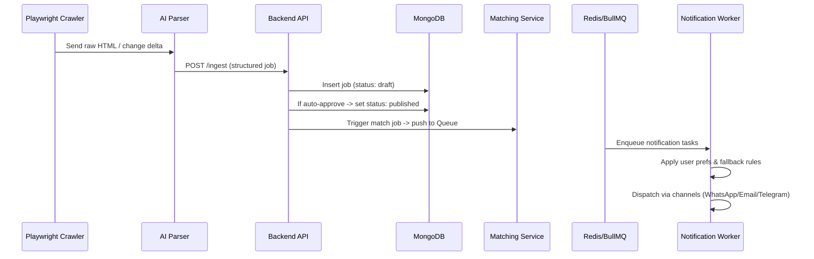
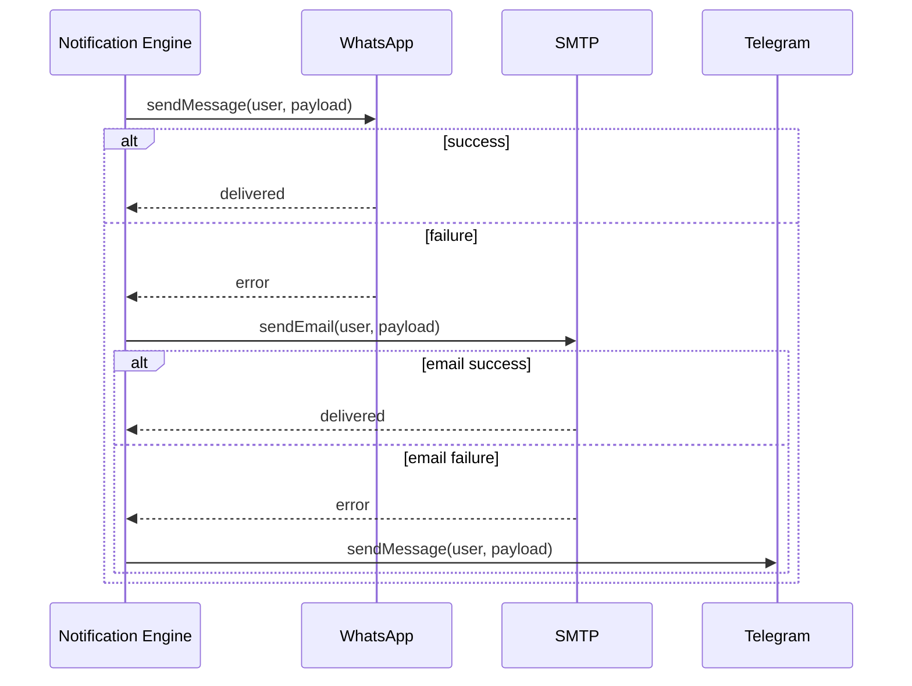

# Architecture Overview — Job Intelligence Platform

This document summarizes the proposed system architecture, components, and interaction flows for JobScout.

Core components
- Frontend (React + Vite): public SEO job pages, user-facing UI, admin UI.
- Backend API (Node + Express): REST API for jobs, users, notifications, admin operations.
- Database (MongoDB + Mongoose): stores Users, Jobs, Companies, Applications, Referrals, Notification logs.
- Cache & Queue (Redis + BullMQ): job ingestion queue, notification queue, rate-limiting and caching.
- Workers (Node): Playwright crawlers, AI integration workers, notification workers.
- AI Service (LLM): external LLM for parsing and matching. Use provider of choice (OpenAI/Azure/Anthropic).
- Messaging channels: SMTP (Nodemailer), WhatsApp Cloud API, Telegram Bot API.
- Monitoring & Logging: centralized structured logs, error tracking (Sentry), metrics (Prometheus/Grafana or hosted SaaS).

High-level sequence (job ingestion)
1. Playwright worker monitors configured career pages or ATS.
2. On change, raw HTML is sent to the AI Job Parser microservice.
3. Parser returns a structured Job object which is saved as a draft in MongoDB.
4. Admin receives optional approval request; admin approves -> job becomes public.
5. Matching engine runs (on schedule or realtime) to match users; matched events push notifications to BullMQ.
6. Notification worker dequeues, applies user preferences and fallback logic, and sends via WhatsApp/Email/Telegram.

Deployment recommendations
- Start with managed MongoDB (Atlas) and managed Redis (AWS Elasticache or Redis Cloud).
- Host backend on container service (AWS ECS/Fargate or GKE) or a PaaS (Render/Vercel for frontend). Use separate clusters for workers.
- Use a message broker and queues (BullMQ on Redis) for reliable background processing.

Security & Compliance
- Use JWT access + refresh tokens, short lived access tokens (15m) and refresh tokens with rotation.
- Enforce rate limits at the gateway (e.g., Nginx or API Gateway) and per-user rate limits in app.
- Log consent decisions for auto-apply and keep audit logs for admin actions.
- Store PII encrypted at rest where required and provide GDPR deletion endpoints.

Questions / Inputs needed
- Cloud provider and account preferences
- LLM provider and API limits/cost constraints
- Messaging channel credentials (SMTP, WhatsApp Cloud, Telegram Bot)

## Architecture Diagram (Mermaid)

```mermaid
flowchart LR
	subgraph Frontend
		A[React (Vite) - Public UI & Admin] -->|API calls| B[API Gateway / Backend API]
	end

	subgraph Backend
		B --> C[Express.js API]
		C --> D[Auth Service (JWT + RBAC)]
		C --> E[Jobs Service]
		C --> F[Matching Service]
		C --> G[Notification Engine]
	end

	subgraph Data
		E --> M[MongoDB (Mongoose)]
		D --> M
		G --> M
	end

	subgraph QueueCache
		Q[Redis] -->|queues| W[BullMQ Workers]
		C -->|enqueue| Q
		W -->|work| C
	end

	subgraph Workers
		W --> P1[Playwright Crawlers]
		W --> P2[AI Parser Worker]
		W --> P3[Notification Worker]
	end

	subgraph Integrations
		P2 --> LLM[LLM Provider (OpenAI/Azure/...)]
		P3 --> SMTP[Nodemailer / SMTP]
		P3 --> WA[WhatsApp Cloud API]
		P3 --> TG[Telegram Bot API]
	end

	%% Admin and Ops
	Admin[Admin UI] --> B
	CI[CI/CD / Docker] -.-> C
	Monitoring[Logs / Metrics / Sentry] -.-> C

	style Frontend fill:#f9f,stroke:#333,stroke-width:1px
	style Backend fill:#bbf,stroke:#333,stroke-width:1px
	style Workers fill:#bfb,stroke:#333,stroke-width:1px
	style Data fill:#ffd,stroke:#333,stroke-width:1px
	style Integrations fill:#fee,stroke:#333,stroke-width:1px

```

## Sequence Flows

### Job Ingestion Sequence



### Notification Flow with Fallback


